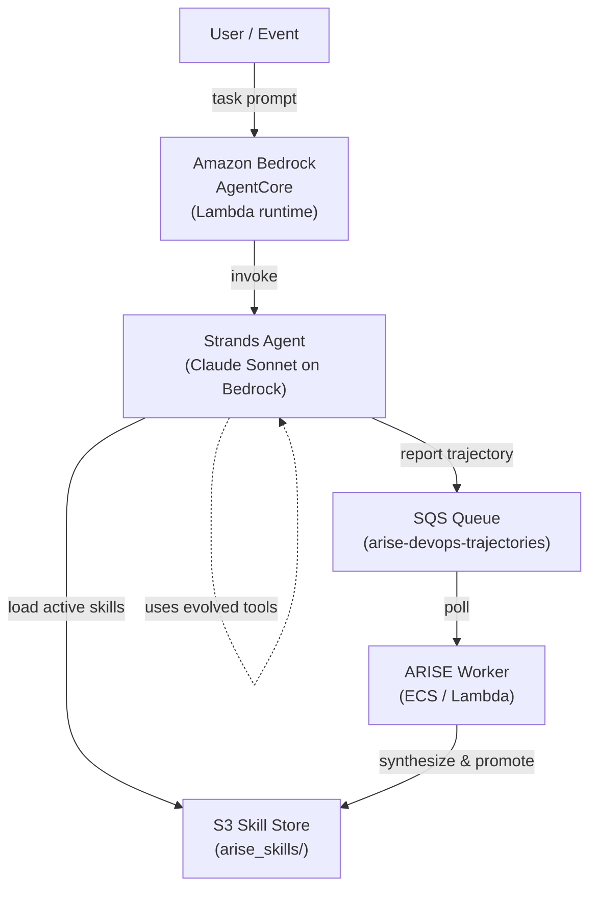

# ARISE DevOps Agent — Amazon Bedrock AgentCore Demo

This demo deploys a **self-evolving DevOps agent** on Amazon Bedrock AgentCore.
The agent starts with zero synthesized tools and evolves them autonomously over
time: when it fails a task it cannot solve, ARISE detects the capability gap,
synthesizes a Python tool using a cheap LLM, validates it in a sandbox, and
promotes it to an S3 skill library. On the next invocation the agent has the
new tool available — no human intervention required.

---

## Architecture



**Flow summary:**
1. A task event arrives at the AgentCore handler (`agent.py::handler`).
2. ARISE loads the current active skill library from S3 (cached with TTL).
3. The Strands Agent (Claude Sonnet on Bedrock) attempts the task using those tools.
4. ARISE scores the outcome with `devops_reward` and sends the trajectory to SQS.
5. The worker (`arise/worker.py`) polls SQS, buffers trajectories, and triggers
   evolution when failure patterns accumulate.
6. New skills are written to S3 and promoted; the next agent invocation picks
   them up automatically.

---

## Prerequisites

- AWS account with access to Amazon Bedrock (Claude Sonnet model enabled)
- An S3 bucket to store the evolving skill library
- An SQS queue for trajectory reporting
- An OpenAI API key (used by ARISE's skill-synthesis model, `gpt-4o-mini`)
- Python 3.11+

---

## Setup

### 1. Create AWS resources

```bash
# S3 bucket
aws s3 mb s3://my-arise-skills --region us-west-2

# SQS queue (standard queue is sufficient)
aws sqs create-queue \
  --queue-name arise-devops-trajectories \
  --region us-west-2
```

Note the queue URL output — you will need it as `ARISE_QUEUE_URL`.

### 2. Set environment variables

```bash
export ARISE_SKILL_BUCKET="my-arise-skills"
export ARISE_QUEUE_URL="https://sqs.us-west-2.amazonaws.com/123456789012/arise-devops-trajectories"
export OPENAI_API_KEY="sk-..."
export AWS_REGION="us-west-2"
```

### 3. Install dependencies

```bash
cd demo/agentcore
pip install -r requirements.txt

# Install the ARISE package from the repo root
pip install -e ../../
```

---

## Running locally

```bash
# Single task
python agent.py "Compute the SHA-256 hash of 'hello world'"

# Run the full 20-task benchmark
python - <<'EOF'
import sys
sys.path.insert(0, "../../")
from agent import arise
from tasks import TASKS

for i, t in enumerate(TASKS, 1):
    print(f"\n[{i:02d}] {t['task'][:80]}")
    result = arise.run(t["task"], metadata={"expected_pattern": t["expected_pattern"]})
    print(f"     {str(result)[:200]}")
EOF
```

### Run the ARISE worker locally (to process trajectories and evolve skills)

```bash
python - <<'EOF'
import sys
sys.path.insert(0, "../../")
from arise.worker import ARISEWorker
from agent import config

worker = ARISEWorker(config=config)
worker.run_forever(poll_interval=5)
EOF
```

---

## Deploying to AgentCore

```bash
# From the demo/agentcore directory
agentcore deploy --config .bedrock_agentcore.yaml

# Invoke the deployed agent
agentcore invoke arise-devops-agent \
  --payload '{"task": "Count error lines in this log: ERROR foo\\nINFO bar\\nERROR baz"}'
```

---

## Expected behavior

| Phase | What happens |
|-------|-------------|
| **Cold start** | Agent has no synthesized tools. It attempts tasks with raw LLM reasoning and often emits `TOOL_MISSING`. |
| **After ~5 failures** | ARISE detects the gap, synthesizes tools (e.g. `parse_csv`, `compute_sha256`, `extract_log_errors`) and promotes them to S3. |
| **Warm** | Agent loads evolved tools from S3 on each invocation. Success rate rises significantly. |
| **Steady state** | Agent has a rich library of DevOps tools and handles the full task set reliably. |

The agent evolves without any code changes or redeployment — the skill library
in S3 is the only artifact that changes over time.

---

## Task domains

The `tasks.py` file contains 20 benchmark tasks across five domains:

| # | Domain | Examples |
|---|--------|---------|
| 1–4 | File parsing | CSV row count, JSON field extraction |
| 5–8 | Log analysis | ERROR counting, IP extraction, level aggregation |
| 9–12 | Text processing | SHA-256 hashing, Base64 encoding, regex extraction |
| 13–16 | Data transformation | Sorting, filtering, deduplication, aggregation |
| 17–20 | URL / network | URL parsing, query string building, hostname extraction |

Each task includes an `expected_pattern` regex that `reward.py` uses to score
the agent's output precisely, providing a strong learning signal to ARISE.

---

## File reference

| File | Description |
|------|-------------|
| `agent.py` | Main entry point — ARISE + Strands Agent wiring, Lambda handler |
| `tasks.py` | 20 benchmark tasks with correctness patterns |
| `reward.py` | Pattern-matching reward function |
| `requirements.txt` | Python dependencies |
| `.bedrock_agentcore.yaml` | AgentCore deployment config |
